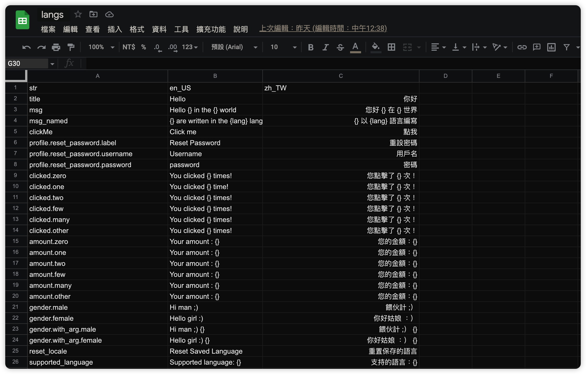
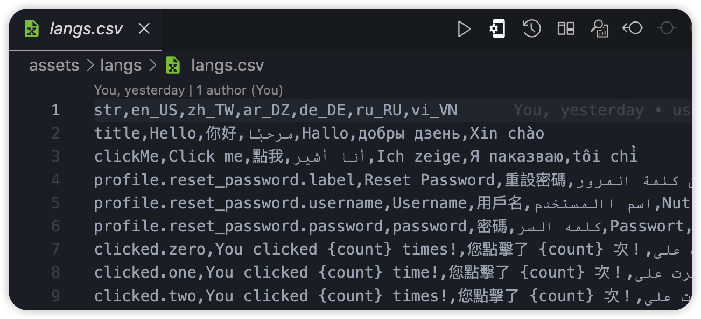
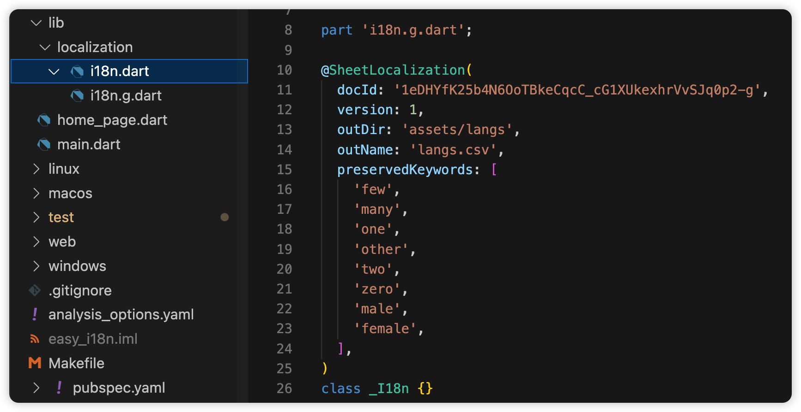
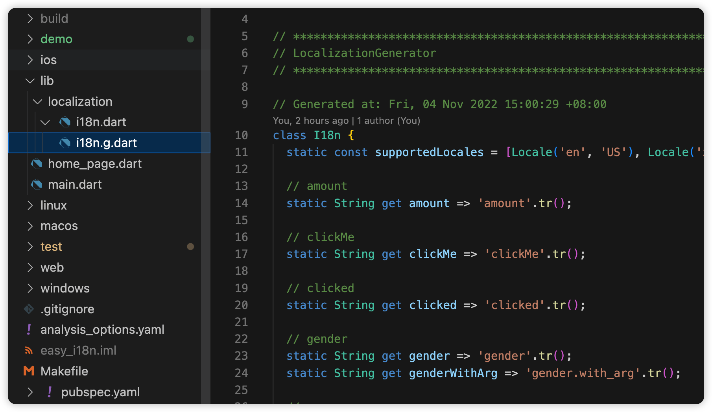
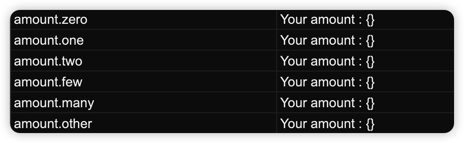
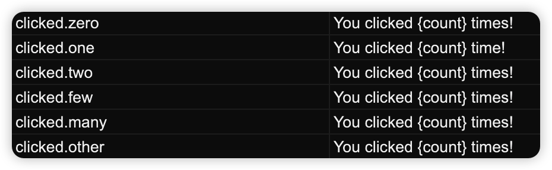

# easy_fast_localization_i18n_example

使用 `easy_localization` 套件實作 Flutter i18n，其中 `easy_localization_generator` 套件負責取得Google sheet並生成字串檔與翻譯檔，接著透過 `easy_localization_loader` 套件存取翻譯檔，最後就能依據設置地區顯示對應語言字串

## Demo






## Package
- easy_localization
- easy_localization_loader
- [easy_localization_generator(My optimized version)](https://github.com/chyiiiiiiiiiiii/easy_localization_generator)

## Optimization
``` dart
// Original: Official package
I18n.title.tr()

// New: My version
I18n.title

```
官方套件在使用多語系字串時都需要在後方額外加上`tr()`，覺得有點多餘，當然如果字串裡面要帶參數更新文字或是其他操作當然不可避免。而這邊我優化了 `easy_localization_generator` 套件，目前已Open在我的Github上，也針對官方發了PR，有後續更新會再跟大家說明。所以如果你想要簡化開發的話，就使用它吧！

## Usage
### Simple text
``` dart
I18n.title
```
### Text with args
``` dart
Text(
  Strings.msg(
    name: 'Jack',
    type: 'Hot',
  ),
),
```
### Text with plural
1. no named arg version

``` dart
Text(Strings.amount(counter))
```
2. named arg version (recommend)

``` dart
Text(
  Strings.clicked(
    counter,
    count: counter.toString(),
  ),
),
```