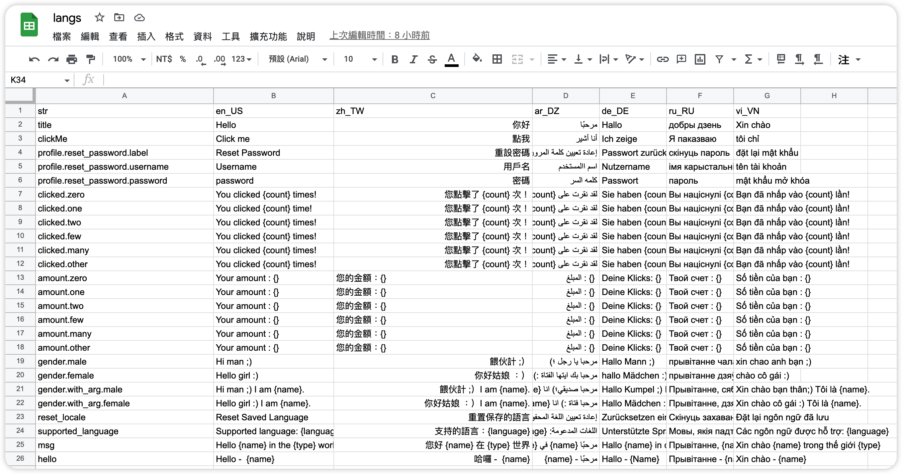

# easy_fast_localization_i18n_example

Use the `easy_localization` package to implement Flutter i18n, where the `easy_localization_generator` package is responsible for obtaining Google sheets and generating string files and translation files, and then accessing the translation files through the `easy_localization_loader` package, and finally displaying the corresponding language strings according to the set region.

## Demo



## Package
- [easy_localization](https://pub.dev/packages/easy_localization)
- [easy_localization_loader](https://pub.dev/packages/easy_localization_loader)
- [easy_localization_generator](https://pub.dev/packages/easy_localization_generator)

## Optimization
``` dart
// Original: Official package
I18n.title.tr()

// New: My version
I18n.title

```
Initially, when the official kit translate multilingual strings, it added `tr()` at the end, which was a bit unnecessary. Of course, it is inevitable if the string contains parameters to update the text or other operations. Here I have optimized the `easy_localization_generator` package. The current version has been merged, which greatly improves the way of use. It can generate functions with named parameters so that developers no longer need to think about what Key needs to be set, and can directly set Value easily. In addition, The usage of the plural has also been adjusted. If you want to improve development efficiency, use it!

## Usage
### Simple text
``` dart
I18n.title
```
### Text with args
``` dart
Text(
  Strings.msg(
    name: 'Jack',
    type: 'Hot',
  ),
),
```
### Text with plural
1. no named arg version


``` dart
Text(Strings.amount(counter))
```

2. named arg version (recommend)


``` dart
Text(
  Strings.clicked(
    counter,
    count: counter.toString(),
  ),
),
```
